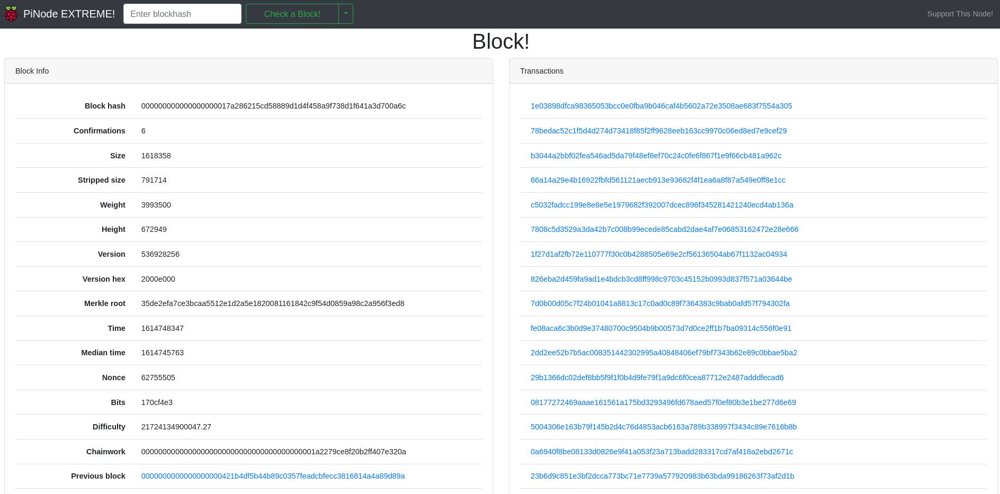

# PiNode EXTREME!

A lightweight Bitcoin block explorer for an indexed Raspberry Pi full node or other lightweight SBC.

## Requirements

* A fully indexed bitcoin node running bitcoind and JSON-RPC (txindex=1)
* [BitcoinGQL](https://github.com/Shadouts/bitcoin-gql) should also be running on the server. This service provides the data API.

## Installation

There are two included methods for running PiNode, direct NodeJS or as a Docker container. Before beginning, ensure that [BitcoinGQL](https://github.com/Shadouts/bitcoin-gql) is properly configured and running.

### Direct NodeJS Server

Node v14+ is supported. [Node Version Manager](https://github.com/nvm-sh/nvm) is recommended. From the repository root directory, perform the following actions:

1. `npm ci`
2. `npm run build`
3. `npm run start`

The HTTP server should now be listening on port 8000. You should be able to browse to http://localhost:8000 to see the dashboard.

### Docker Container

Docker v20.10+ is supported. From the repository root directory, perform the following actions:

1. `docker build . -t pinode-extreme`
2. `docker run --network host pinode-extreme`

The HTTP server should now be listening on the host machine's port 8000. You should be able to browse to http://localhost:8000 to see the dashboard.

## Disclaimer

This was recently ported over from a very old Apache/jQuery version to now use more modern technologies and to ease further development. It is a work in progress. Please [open an issue](https://github.com/Shadouts/pinode-extreme/issues/new) if you discover any bugs.
